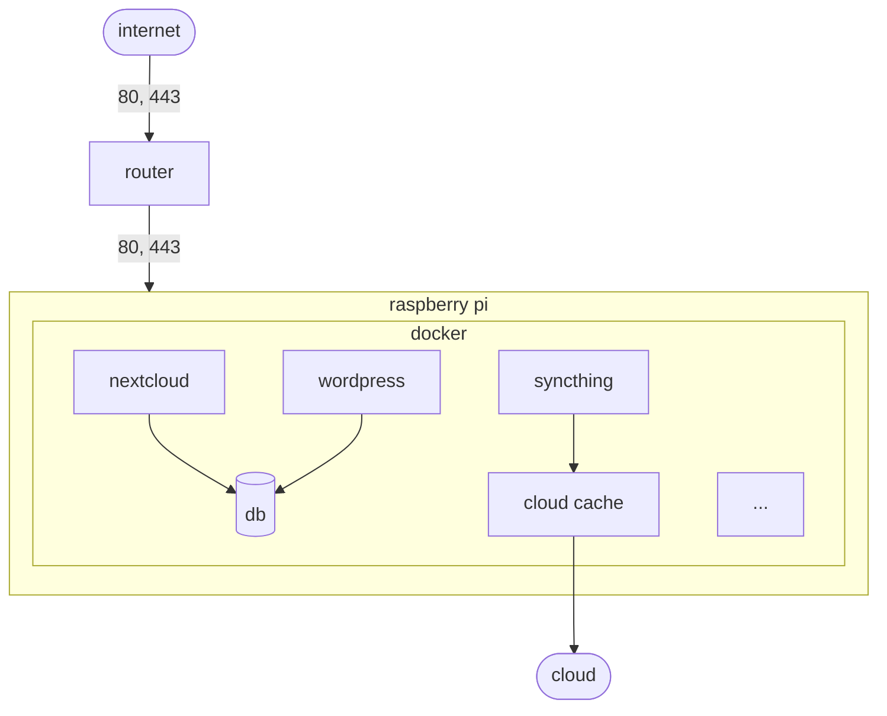

# HOME CLOUD 🏠💨

- run a cloud at home
- (i run it on a raspberry pi)
- it's basically just a docker-compose file, but it does require some prep
- add services as you go

## Table of Contents
1. [PREREQUISITES](#prerequisites)
2. [GETTING STARTED](#getting-started)
3. [THE SERVICES](#the-services)
4. [BACKUP](#backup)
5. [UPGRADE](#upgrade)
6. [CLOUD STORAGE](#cloud-storage)
6. [TODO](#todo)

## PREREQUISITES 
- a server (e.g. a raspberry pi)
- `docker`
- `make`
- a domain name, unless you only care about IP access
- this has only been tested on a Linux machine

## GETTING STARTED 

### 1. ALLOW WEB TRAFFIC TO YOUR SERVER
- in your router's web ui, find a way to give your server a static IP address (e.g. 192.168.1.100)
- in your router's web ui, port-forward ports 80 & 443 to your server
  - you may need to reconfigure your router's admin web ui to use a different port
    - e.g. change your router's web ui address from "http://192.168.1.1" to "http://192.168.1.1:8080"

### 2. DYNAMIC DNS
- if your ISP only gives you a dynamic IP address, it should be ok
- very likely your domain name registrar exposes a REST API (check the settings page)
- if so, there is likely an endpoint for updating IP addresses. write a script to periodically call the REST API with your current public IP address (just a crontab + curl)

### 3. CREATE DATABASE USERS
- nextcloud & wordpress need database access, so configure db users first
- we need a root user, and then one user per service

1. configure a **root** password for your db by setting the `MYSQL_ROOT_PASSWORD` environment variable in the "db" container in `docker-compose.yaml`
2. start the database container:
  - `docker compose up db`
2. connect to the DB, for example:
  - remote into the DB container: `docker exec -it db sh`
  - then connect to mysql: `mysql -u root -p`
4. create the nextcloud DB user:
  - `CREATE USER 'netxclouduser'@'localhost' IDENTIFIED BY '1234';`   <== change password
  - `GRANT ALL PRIVILEGES ON nextcloud.* To 'netxclouduser'@'%';`
  - `FLUSH PRIVILEGES;`
5. create the wordpress DB user:
  - `CREATE USER 'wordpressuser'@'localhost' IDENTIFIED BY '1234';`   <== change password
  - `GRANT ALL PRIVILEGES ON wordpress.* To 'wordpressuser'@'%';`
  - `FLUSH PRIVILEGES;`

### 4. CONFIG
- copy `.env.example` to `.env`
- populate `.env`

### 5. CREDENTIALS
populate the following files with credentials:
- ./secrets/db_nexctloud_password
- ./secrets/db_wordpress_password
- ./secrets/pihole_password

### 6. GO GO GO 🏃‍♂️
- start everything with `make up`

## THE SERVICES 

### 1. MARIADB 💾
- DB for files & blog
- the dockerhub image does not support arm/v7, so using the https://www.linuxserver.io image

### 2. NEXTCLOUD 💨
- https://nc.yourwebsite.com
- private cloud
- has mobile apps

### 3. WORDPRESS 👨‍💻
- https://yourwebsite.com
- blog
- takes the top-level domain
- from there you can use wordpress to make a nice homepage

### 4. PIHOLE 🛑
- https://pihole.yourwebsite.com
- ad-blocking DNS (useful for iphones)

### 5. REVERSE-PROXY 🚦
- container: `proxy` 
- simplifies hosting multiple websites on one server
- e.g. nextcloud & wordpress

### 6. LETSENCRYPT 🔐
- container: `proxy-acme`
- automatically configures HTTPS for all sites
- (auto-generates & auto-updates TLS certificates)

### 7. PCLOUD & SYNCTHING 🔄
- TODO
- AIM: sync a pcloud vault on phone to cloud storage (pcloud, in this case)
- a ghetto version of "obsidian sync", i.e. syncthing acts as a relay
- i.e. folder of markdown files on phone <=> syncthing <=> cloud

## BACKUP 
- the containers are stateless, they can be rebuilt
- however the volumes are stateful (e.g. the DB), and a backup is a good idea
- inspiration: https://stackoverflow.com/questions/45714456/how-to-migrate-docker-volume-between-hosts 
- copy volume to local storage
  - `make backup`
- then copy it to another host and start with e.g.
  - `docker run -v ./LOCAL_FOLDER:/MOUNT_POINT_OF_VOLUME some_image`
- TODO: store backups on cloud storage

## UPGRADE 

### MAJOR UPGRADE
- all containers are version-pinned (i.e. never "latest")
- when upgrading, increment services' major versions +1 at a time
- increment the version, then restart the container

### MINOR UPGRADE
- `docker-compose pull`
- `docker-compose up -d --remove-orphans`
- `docker image prune`

## CLOUD STORAGE 
if you can sync or backup the data above to a cloud storage provider, then this server becomes wonderfully disposable. i don't want to rely on the longevity of my server. if it dies, i want to go buy a new one, execute this repo, and be back in action. the cloud storage then acts exactly like that - a nice, dumb, backing store - and this server then adds services on top of it.

## TODO 
- store backups on cloud storage
- finish pcloud & syncthing (as above)
- add piwigo
  - store images on cloud store
  - use piwigo to manage images
  - presumably piwigo will have it's own DB of metadata
  - backup the DB volume, etc
